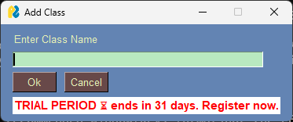

# **User Manual for Mark Registry Application**

## **Introduction**

The Mark Registry Application is a GUI-based tool for managing student records and subjects in a MySQL database. This manual provides guidance on how to use the application to add, remove, and edit subjects and students.

## **Getting Started**

### **Installation**

1. **Prerequisites**
   - Python 3.x installed on your system.
   - MySQL server installed and running.
   - Required Python libraries: `PySimpleGUI`, `mysql-connector-python`, `pickle`, `tabulate`.

2. **Install Dependencies**

   Install the necessary libraries using pip:

   ```bash
   pip install PySimpleGUI mysql-connector-python tabulate
   ```

### **Configuration**

1. **Initial Setup**
   - Run the application to set up the initial configuration.
   - The application will prompt you to enter MySQL database credentials.

2. **Configuration File**
   - The application saves the configuration (username, host, password) in a file named `CONFIG`.
   - The application will use this file to connect to your MySQL database in future runs.

## **Using the Application**

### **Login**

1. **Login Window**
   - On startup, the application will display a login window.
   - Enter your MySQL username, host, and password.
   - Click **"Login"** to connect to the database.
   - Click **"Quit"** to exit the application.

### **Main Menu**

If it's your first time logging in, then you'll be greeted with this screen 
<br>

<br>
Start by adding a class.


After logging in, the main menu will appear, allowing you to select or manage classes.


1. **Add Class**
   - Adds a new class to the system. You will be prompted to provide details. <br>
   

2. **Delete Class**
   - Removes an existing class from the system. You will select the class to be deleted. <br>
   

3. **Use Class**
   - Selects a class for editing or viewing. You can choose from the list of available classes. <br>
   

4. **Edit Class**
   - Modify details of an existing class. <br>
   

5. **Change Theme**
   - Allows you to change the visual theme of the application. <br>
   
   

### **Managing Classes**

When you select a class, you can manage subjects and students within that class.

#### **Add Subjects**

1. **Open Add Subjects Window**
   - Click **"Add Subjects"** from the class management menu. <br>
   


2. **Add New Subjects**
   - Enter the name of the subject and click **"Add Subject"**.
   - Confirm the addition by clicking **"Confirm"**.
   - Use **"Undo"** to remove the last added subject.
   - Click **"Cancel"** to exit without saving changes.

#### **Add Students**

1. **Open Add Students Window**
   - Click **"Add Students"** from the class management menu. <br>
   


2. **Add New Students**
   - Enter the student’s name and click **"Add Student"**.
   - Confirm the addition by clicking **"Confirm"**.
   - Use **"Undo"** to remove the last added student.
   - Click **"Cancel"** to exit without saving changes.

#### **Remove Subjects**

1. **Open Remove Subjects Window**
   - Click **"Remove Subjects"** from the class management menu. <br>
   


2. **Select Subjects to Remove**
   - Check the boxes next to the subjects you want to remove.
   - Click **"Submit"** to confirm removal.
   - Click **"Cancel"** to exit without making changes.

#### **Remove Students**

1. **Open Remove Students Window**
   - Click **"Remove Students"** from the class management menu. <br>
   


2. **Select Students to Remove**
   - Check the boxes next to the students you want to remove.
   - Click **"Submit"** to confirm removal.
   - Click **"Cancel"** to exit without making changes.

### **Changing Themes**

1. **Open Theme Selection Window**
   - Click **"Change Theme"** from the main menu.

2. **Select a Theme**
   - Choose from the available themes or select **"Random"** to get a random theme.
   - Click **"Save Changes"** to apply the selected theme.
   - Click **"Discard Changes"** to revert to the previous theme.

## **Error Handling**

- **Login Errors**: If login fails, verify your credentials and try again.
- **Database Errors**: Ensure the MySQL server is running and the database exists.

## **Exiting the Application**

1. **Quit Option**
   - Click **"Quit"** from the main menu or any open window to exit the application.
   - Confirm the exit in the popup that appears.

## **Troubleshooting**

- **Database Connection Issues**: Verify your database credentials and server status.
- **GUI Issues**: Ensure all dependencies are properly installed.

## **Support**

For further assistance, please contact support via email or check the application’s official documentation and forums.

---

This manual should cover the key aspects of using your Python application. If there are specific features or additional details you’d like to include, let me know!
